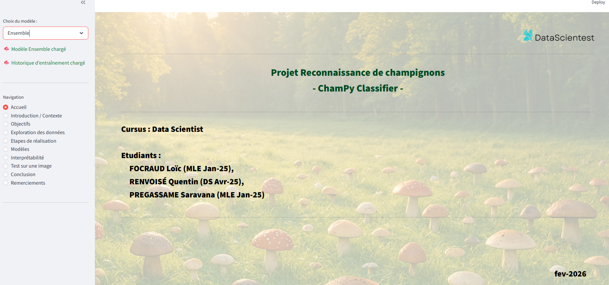
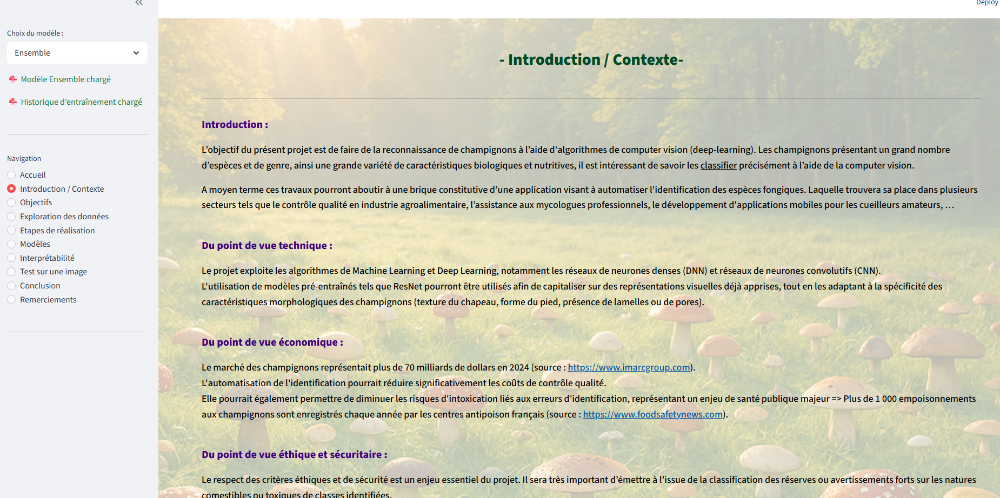
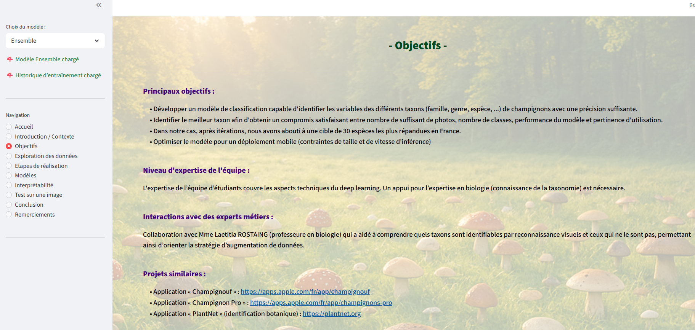
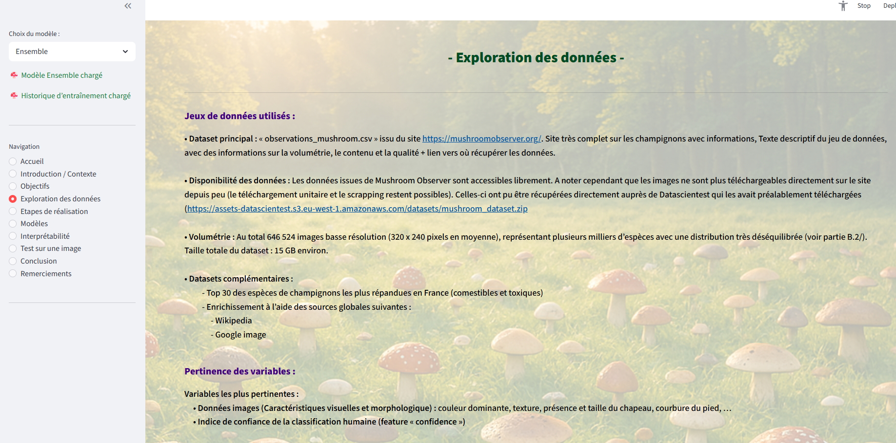
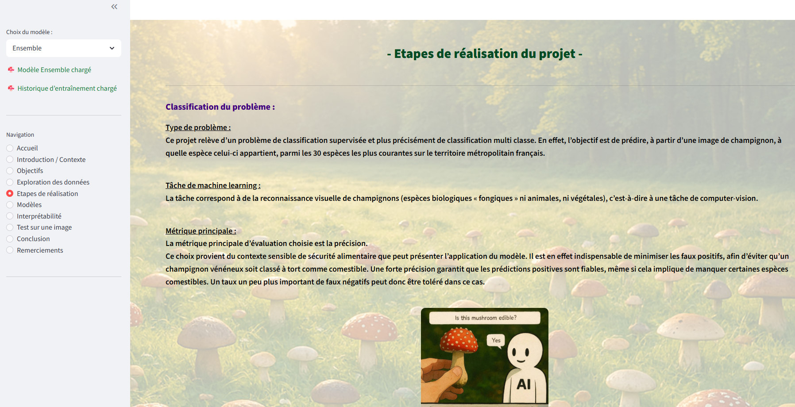
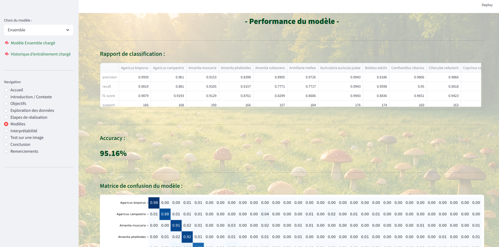
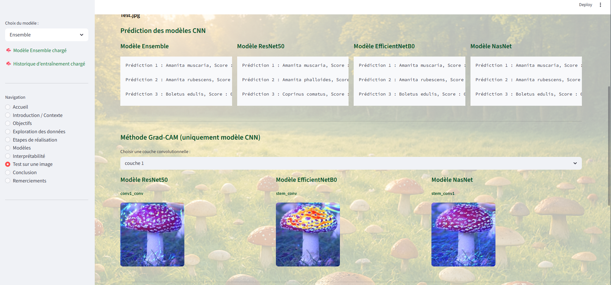
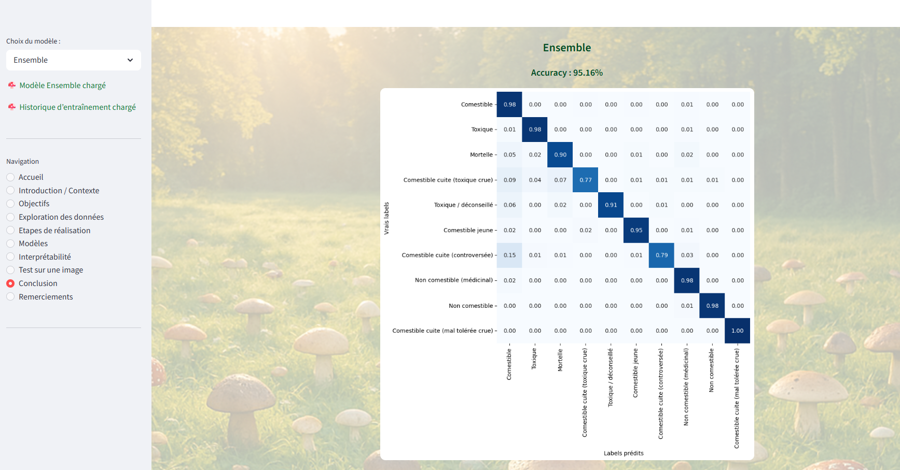

# 🔍 Reconnaissance de champignons

Usage de plusieurs modèles pour faire de la Computer Vision et Présentation des résultats sur page Web

## 🏗️ Architecture
```
Data ingestion (images) → Data exploration → Feature Engineering → Models Training → Models Prediction (accuracy) → Interprétabilité → Streamlit presentation
```

## 🛠️ Stack technique

| Composant | Technologie |
|---|---|
| Modèles | Random Forest, KNN, DNN, CNN, ResNet50, EfficientNetB0, NasNet, Ensemble (soft voting) |
| Dataviz | Streamlit |


## 📊 Performances

- **Accuracy** : 95.16%

## 🚀 Lancer la présentation

### Prérequis
- Python 3.11+
- Sreamlit

### Lancement
```bash
# Terminal 
streamlit run "./src/4 - streamlit/app2.py" 
```

## 📁 Structure du projet
```

    ├── LICENSE
    ├── README.md          <- The top-level README for developers using this project.
    ├── datasets           <- In local computer but not on Github
    │   ├── processed      <- The final, canonical data sets for modeling.
    │   └── raw            <- The original, immutable data dump.
    │   └── champignons_france_top30.csv  
    │   └── datase_30_species.csv  
    │
    ├── docs               <- Screenshot images from Streamlit
    │
    ├── images             <- Images used in Streamlit web pages
    │
    ├── models             <- Trained and serialized models, model predictions, or model summaries
    │
    ├── notebooks          <- Jupyter notebooks. Naming convention is a numbe,
    │   ├── 1.4-loic-data-exploration_V4_Final.ipynb                                
    │   ├── 2.3-loic-création_dataset_Species_V2_Final.ipynb
    │   ├── 2.5-sp-création_dataset_Species_V5_Final.ipynb
    │   ├── 3_6_2_sp_CNN_TL_V3_nasnet_model3_Final.ipynb
    │   ├── 3_7_0_sp_CNN_TL_V3_ensemble_model3_Final.ipynb
    │   ├── 3.1.0-loic-Random_Forest_V0_Final.ipynb
    │   ├── 3.2.0-loic-KNN_V0_Final.ipynb
    │   ├── 3.3.3-loic-DNN_V3_Final.ipynb
    │   ├── 3.4.4-loic-CNN_V4_Final.ipynb
    │   ├── 3.5.0-loic-CNN2_V0_Final.ipynb
    │   ├── 3.6.0-loic-CNN_TL_V0_Final.ipynb
    │   ├── 3.6.0-sp-CNN_TL_Resnet_V1_model3_Final.ipynb
    │   ├── 3.6.2-sp-CNN_TL_V3_efficientnetB0_model3_Final.ipynb
    │   ├── 3.7.0-loic-CNN_TL2_V0_Final.ipynb
    │   ├── 4.2-loic-Interprétabilité_V2_Final.ipynb
    │   ├── 4.2-sp-Interprétabilité_EfficientnetB0_V1_Final.ipynb
    │   └── 4.2-sp-Interprétabilité_Ensemble_V1_Final.ipynb
    │                         
    ├── references         <- Data dictionaries, manuals, links, and all other explanatory materials.
    ├── pyproject.toml    
    ├── uv.lock    
    ├── .gitignore         <- fichiers à ignorer quand on met sous github (comme models)
    ├── .dockerignore      <- fichiers à ignorer quand on constitue le conteneur Docker
    ├── Dokerfile          <- Constitution du conteneur streamlit_app
    ├── docker-compose.yml <- lancement des conteneurs streamlit et nginx
    ├── nginx.conf         <- configuration nginx 
    │
    ├── reports            <- Reports for the project
    │   ├── 2025-08-31_DS_Mushroom_Rapport_1_Data_explo_Dataviz_Prepocess_V3.docx
    │   ├── 2025-11-08_DS_Mushroom_Rapport_2_Modélisation_V3.docx
    │   └── 2026-01-10_DS_Mushroom_Rapport_Final_V0.docx       
    │
    ├── requirements.txt   <- The requirements file for reproducing the analysis environment
    │
    └── src                <- Source code for use in this project.
        ├── __init__.py    <- Makes src a Python module
        │
        ├── 1 - data exploration           <- Scripts to explore data
        │   └── data-exploration.ipynb
        ├── 2 - constitution dataset       <- Scripts to feature dataset
        │   └── dataset.py
        ├── 3 - models                     <- Scripts to train and to evaluate models
        │   ├── 1 - train_model_random_forest.py
        │   ├── 2 - train_model_KNN.py
        │   ├── 3 - train_model_DNN.py
        │   ├── 4 - train_model_CNN.py
        │   ├── 5 - train_model_CNN2.py
        │   ├── 6 - train_model_CNN_ResNet50.py
        │   ├── 7 - train_model_CNN_EfficientNetB0.py
        │   ├── 8 - train_model_CNN_NasNet.py
        │   └── 9 - predict_model_Ensemble.py
        │
        └── 4 - streamlit                  <- Scripts to launch web presentation
            ├── app2.py
            ├── functions2.py
            └── settings2.py
```

## 📈 Streamlit pages








